<!-- @format -->

## 01.开始装机

因为买的腾讯云，这次选择了腾讯云自己二次开发的`OpenCloudOS 9`系统，相比较最原始的`CentOs`，这个系统在界面上稍微开放了一点换肤功能。

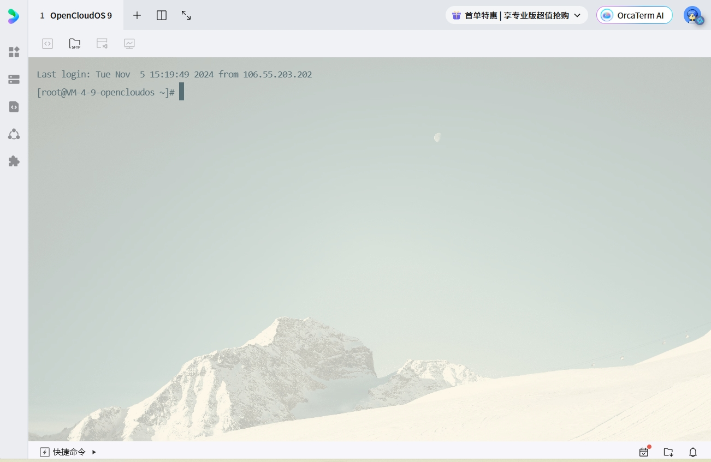

这是初始状态下的远程桌面，我小小使用了一下换肤功能。

## 02.`XShell`远程服务器

之后就是使用本地的`XShell`工具，远程连接服务器。

然后这里出现了问题，ssh登录的时候，出现了`Connection failed`的提示。

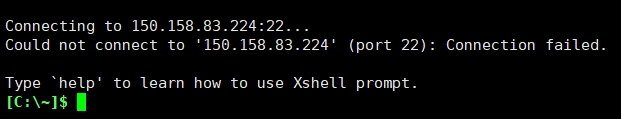

后面各种尝试了之后（包括确定端口是否开放等因素），才试探性的换了一个外部网络，居然成功了！！！！！

我是说我怎么就卡在了这么简单的第一步了，还各种无解方案......

搞半天是我的所在的内部网络被墙了啊😂

## 03.端口策略

端口的放行很重要，这关乎后面进行的各种服务。

因为之前那台服务器的端口策略可以直接照抄，因此，这里不做赘述。

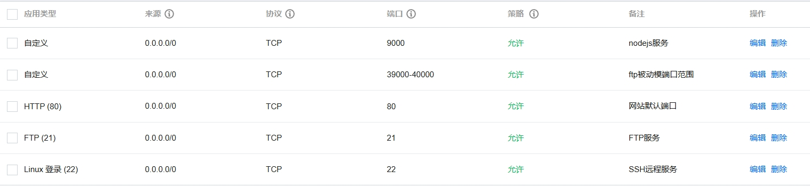

## 04.安装并设置nginx

前端网页的访问离不开nginx的转发，因此安装nginx是必须的。

### 安装nginx

在开始安装Nginx之前，首先需要安装一些依赖项，以确保Nginx编译和运行正常。打开终端并执行以下命令：

```shell
yum install -y wget gcc-c++ pcre-devel zlib-devel openssl-devel
```

这将安装必要的工具和库，以支持Nginx的编译和运行。

nginx官网网址：[http://nginx.org/en/download.html](http://nginx.org/en/download.html)

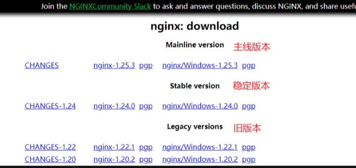

选用中间的稳定版本即可

```shell
# 选择一个下载文件目录
cd /data/download
# 例如，下载Nginx 1.24.0版本
wget https://nginx.org/download/nginx-1.24.0.tar.gz
```

### 解压nginx

在当前目录下，解压下载的Nginx源代码包：

```shell
tar -zxvf nginx-1.24.0.tar.gz
```

### 编译和安装

进入解压后的Nginx目录并进行编译和安装：

```shell
# 切换到 Nginx 解压目录
cd nginx-1.24.0
# 编译前的配置和依赖检查
./configure
# 假如安装报错（一）
yum -y install pcre-devel
# 加入安装报错（二）
yum -y install openssl openssl-devel
# 重新运行安装命令 ./configure
```

正确的安装成功之后 nginx会显示你的默认安装路径如下

```shell
nginx path prefix: "/usr/local/nginx"
nginx path prefix: "/usr/local/nginx"
nginx binary file: "/usr/local/nginx/sbin/nginx"
nginx modules path: "/usr/local/nginx/modules"
nginx configuration prefix: "/usr/local/nginx/conf"
nginx configuration file: "/usr/local/nginx/conf/nginx.conf"
nginx pid file: "/usr/local/nginx/logs/nginx.pid"
nginx error log file: "/usr/local/nginx/logs/error.log"
nginx http access log file: "/usr/local/nginx/logs/access.log"
nginx http client request body temporary files: "client_body_temp"
nginx http proxy temporary files: "proxy_temp"
nginx http fastcgi temporary files: "fastcgi_temp"
nginx http uwsgi temporary files: "uwsgi_temp"
nginx http scgi temporary files: "scgi_temp"
```

编译nginx

```shell
# 编译安装
make && make install
```

查看nginx是否安装成功

```shell
whereis nginx
```

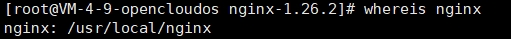

### 运行并设置nginx

#### 启动nginx

```shell
# 进入nginx执行文件目录
cd /usr/local/nginx/sbin

# 启动nginx
./nginx
# 查看运行状态
ps -ef | grep nginx
```

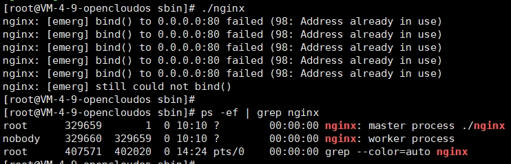

设置成功即可看到默认端口80访问状态

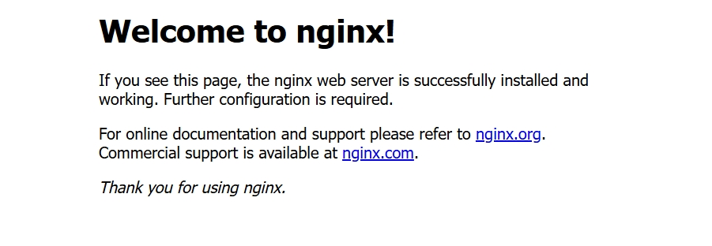

#### 关闭nginx

```shell
# 关闭nginx
./nginx -s stop
# 查看运行状态
ps -ef | grep nginx
```

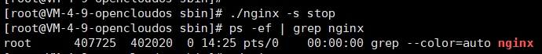

#### 重启nginx

```shell
# 重启nginx
./nginx -s reload
# 查看运行状态
ps -ef | grep nginx
```

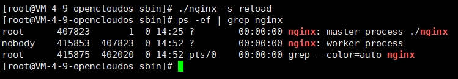

#### nginx配置目录

```shell
# 可以直接进入配置文件在线修改
vim /usr/local/nginx/conf/nginx.conf
```

配置规则可参考上一台服务器已经配置好的规则。

主要反向代理规则如下；

```shell
server {
    listen       80;
    server_name  localhost;
    root  /data/www/my_blog;
    index index.html index.php;

    location ^~ /perfect-admin {
        alias /data/www/perfect-admin;
        try_files $uri $uri/ /perfect-admin; 
        index index.html;
    }
            
    location ^~ /gallery {
        alias /data/www/perfect-server/public/file_cache;
        try_files $uri $uri/ /gallery; 
    index index.html;
    }
    
    # 接口反向代理
    location ^~ /center-back-stage {
        proxy_pass http://127.0.0.1:9000/center-back-stage;
        proxy_set_header Host $host:$server_port;
        proxy_set_header X-Real-IP $remote_addr;
        proxy_set_header X-Forwarded-For $proxy_add_x_forwarded_for;
        proxy_set_header X-Forwarded-Proto $scheme;
    }

    error_page  404              /404.html;

    # redirect server error pages to the static page /50x.html
    #
    error_page   500 502 503 504  /50x.html;
    location = /50x.html {
        root   html;
    }
    
    location ~ .*\.(gif|jpg|jpeg|png|bmp|swf)$
    {
        expires      30d;
    }

    location ~ .*\.(js|css)?$
    {
        expires      12h;
    }

    location ~ /\.
    {
        deny all;
    }

    # access_log  /www/wwwlogs/access.log;
}
```

## 05.配置NodeJs项目

目前使用了一种最low的方式，在9000端口运行了一个NodeJs服务，并且为了简化部署流程，在项目路径下直接配置了git服务，需要每次重新拉取最新的代码，手动重启服务。

怎么说呢，虽然需要手动的部分确实是多了一点，但是其实后端服务更新的频率并不高，唯手熟尔。

### 配置git环境

```shell
# 先下载相关依赖
yum install curl-devel expat-devel gettext-devel openssl-devel zlib-devel
# 下载git
yum -y install git-core
# 验证git版本
git --version
```

### github配置ssh key

```shell
# 新增本地ssh key
ssh-keygen -t ed25519 -C "email"
```

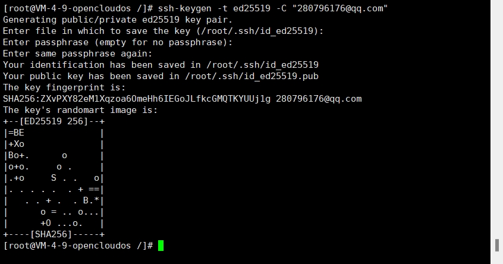

```shell
# 查看ssh目录下所有文件
ls -al ~/.ssh

cd ~/.ssh

# 查看ssh key
cat id_ed25519.pub
```

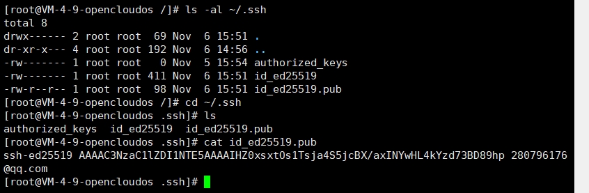

有了新增的ssh key，我们可以打开github的设置界面进行设置。

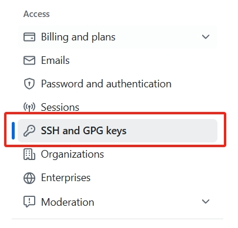

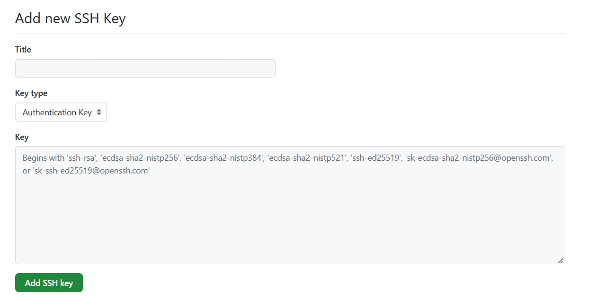

### 本地运行服务

#### 安装NodeJs

```shell
# 跟本地nodejs同步，安装了版本v18.18.2
wget https://nodejs.org/dist/v18.18.2/node-v18.18.2-linux-x64.tar.xz
# 解压安装包
tar xf node-v18.18.2-linux-x64.tar.xz
```

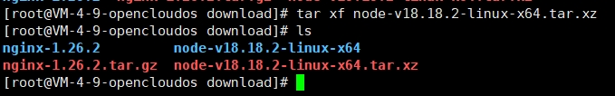

```shell
# 新建nodejs包存放目录
mkdir /usr/local/lib/node
# 移动解压包到指定目录 并文件夹名称
mv node-v18.18.2-linux-x64 /usr/local/lib/node/nodejs
```

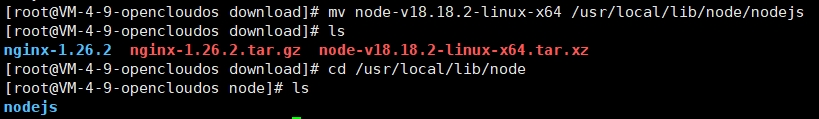

**设置环境NodeJs环境变量**

```shell
# 访问设置文件
sudo vim /etc/profile
# 在最底部加入环境变量
export NODEJS_HOME=/usr/local/lib/node/nodejs
export PATH=$NODEJS_HOME/bin:$PATH
# 刷新修改
source /etc/profile
```

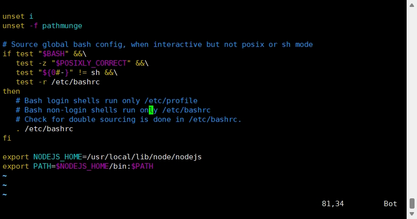

安装完成，查看版本号

```shell
# nodejs version
node -v
# npm version
npm -v
```

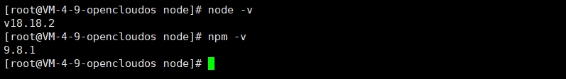

nodejs有一个运营利器`pm2`，可以保持NodeJs服务的运行。

### PM2安装和使用

安装之前需要更改`npm`的镜像源，换成更快一些的淘宝源，并且可以安装一下`yarn`。

```shell
# 设置npm源
npm config set registry https://registry.npmmirror.com/
# 查看npm源
npm config get registry
# 全局安装yarn
npm i yarn -g
# 设置yarn源
yarn config set registry https://registry.npmmirror.com/
# 查看yarn源
yarn config get registry
```

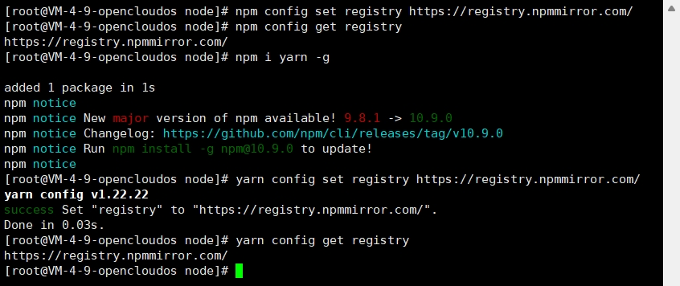

```shell
# 利用npm全局安装pm2
npm i pm2 -g
```

具体的使用指南可以跳转[https://pm2.fenxianglu.cn/docs/start](https://pm2.fenxianglu.cn/docs/start)

```sh
# 查看pm2进程
pm2 list
# 删除并停止某个进程
pm2 delete 1
```

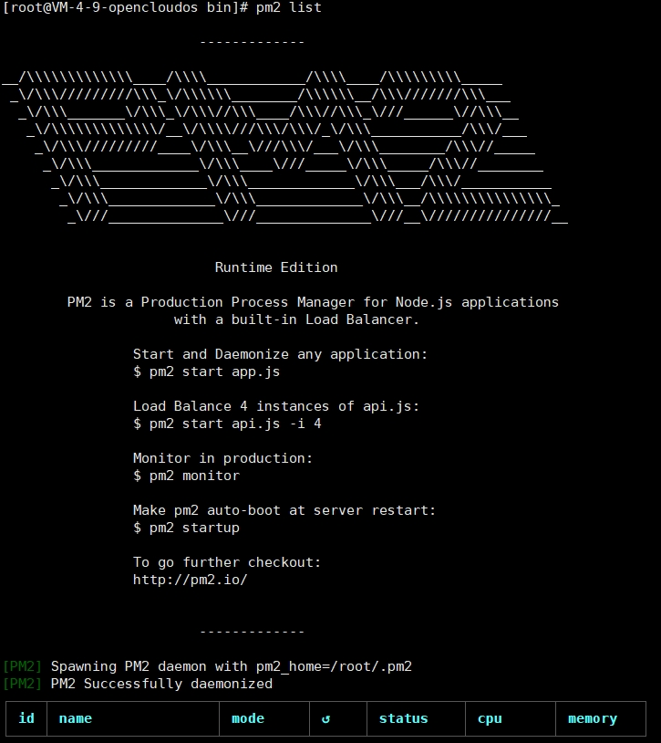

## 06.配置Mysql数据库

不知道是版本问题还是安装步骤某个环节缺失，搜了N个帖子之后，重装系统了N次之后，总算是成功的安装好了Mysql。

为了方式下次安装还会有这样的问题，详细记录在此。

### 卸载自带的mariadb数据库

```sh
# 查询
rpm -qa | grep mari
# 关于maria都要删除
rpm -e --nodeps mariadb
```

### 下载Mysql

官方包下载地址[https://downloads.mysql.com/archives/community/](https://downloads.mysql.com/archives/community/)

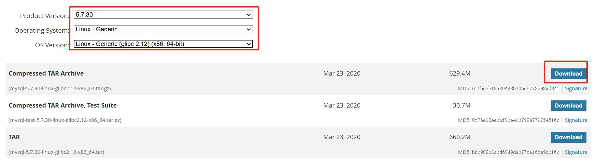

这次选择的是版本`5.7.30`，按图下载压缩包之后，将压缩包直接传到服务器上

```sh
# 例如新建一个存放下载文件的目录
mkdir /data/download
# 进入目录
cd /data/download
# 解压到当前目录下
tar -xvf mysql-5.7.30-linux-glibc2.12-x86_64.tar
# 移动解压包到指定目录 并重命名
mv mysql-5.7.30-linux-glibc2.12-x86_64 /usr/local/mysql
```

### 建立用户组

先查看一下，当前的Linux中是否存在mysql的用户和组

```sh
cat /etc/passwd | grep mysql
cat /etc/group  | grep mysql
```

添加用户和组

```sh
groupadd mysql
useradd -r -g mysql mysql
```

### 创建目录并修改权限

```sh
mkdir -p /data/mysql
```

查看一下 /data/mysql 以及刚刚解压缩的 /usr/local/mysql 的权限，发现其所属用户和组均为root

```sh
ls -dl /usr/local/mysql/
ls -dl /data/mysql/
```

将所有者和组均改为mysql

```sh
chown -R mysql.mysql /usr/local/mysql
chown -R mysql.mysql /data/mysql
```

### 初始化mysql

```sh
/usr/local/mysql/bin/mysqld --user=mysql --basedir=/usr/local/mysql/ --datadir=/data/mysql --initialize
```

会生成一个默认密码，记住等会需要使用。

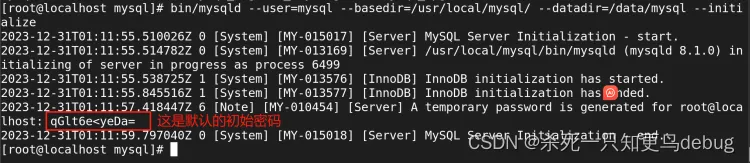

### 配置my.cnf配置文件

因为我们是那个压缩包安装，即离线安装，所以这个my.cnf是需要自己手动配置的

```sh
vim /etc/my.cnf
```

将下面的内容，输入到 /etc/my.cnf中，这里要注意，坑来了，直接指定socket的目录，不用什么软连接。

```sh
[mysqld]
datadir=/data/mysql
basedir=/usr/local/mysql
socket=/var/lib/mysql/mysql.sock
user=mysql
port=3306
character-set-server=utf8
# 取消密码验证
# skip-grant-tables
# # Disabling symbolic-links is recommended to prevent assorted security risks
symbolic-links=0
[mysqld_safe]
log-error=/var/log/mysqld.log
pid-file=/var/run/mysqld/mysqld.pid
```

### 启动服务

这里的话，需要将mysqld服务找到，然后复制到 /etc/init.d/mysqld（因为默认的离线安装，它是不识别这个mysqld的）

```sh
find / -name mysql-server  # 查找mysql服务
# 如果不存在 /etc/init.d 那么就自己 mkdir /etc/init.d 再进行拷贝
# 存在直接拷贝
cp /usr/local/mysql/support-files/mysql.server /etc/init.d/mysqld # 复制
```

然后需要安装一下mariadb-server的服务，因为mysql.service依赖于此

```sh
yum install -y mariadb-server # 1. 安装服务
systemctl start mariadb.service # 2.启动服务
systemctl enable mariadb.service # 3.设置为开机自启
```

启动mysql服务

```sh
service mysqld start
```

### 修改mysql初始密码

```sh
mysql -uroot -p # 进入mysql
# 输入临时密码  例如我的：qGlt6e<yeDa=
# 设置密码一次
SET PASSWORD = PASSWORD('123456');
# 设置密码二次 这里很关键，以防只有一步时报错。
ALTER USER 'root'@'localhost' IDENTIFIED BY '123456';
```

### 设置root账户远程权限

```sh
use mysql;
update user set host ='%' where user ='root' and host ='localhost'; # root@localhost 实际访问名称
# 刷新
flush privileges;
exit;
```

### 设置新的远程账号

安全问题，可以另外建设一个新的账号，专用于远程操作。

```sh
# 设置一个新账号
create user test identified by '123456';
# 分配权限
grant all privileges on . to 'test'@'%'identified by '123456' with grant option;
# 刷新
flush privileges;
# 查询用户信息
select host,user from user;
```

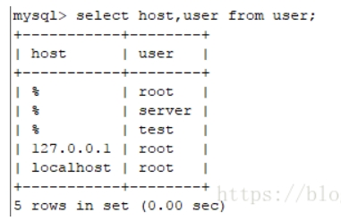

这样就可以使用新建的账号进行远程登录操作。
