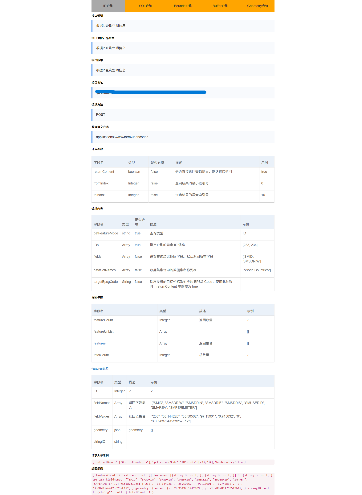

<!-- @format -->

## 入门指南

超图官网给开发者出示了一份基础的[入门指南](http://support.supermap.com.cn:8090/webgl/Cesium/web/introduction/3DforWebGL.html#createMap)，常用的图层、地形、数据服务基本都有涉及到，这里不再赘述。

因为对接的是基于超图的第三方数据提供商，接入方法跟文档中提到的大同小异，区别最大的可能就是数据服务。根据使用需求不同，有不同的使用场景，但是有区别的只是参数的结构不太一样。



数据服务，也就是地图图层对应的某个坐标值或者某段范围内的数据展示。

图层+数据接口，这才是一套完整的地图数据。

## 实例化

让咱们跳过基本安装步骤，开始一个基本的地图实例化。

```javascript
const viewer = new Cesium.Viewer("cesium-map", {
    shouldAnimate: true,
    animation: false, // 是否创建动画小器件，左下角仪表
    baseLayerPicker: false, // 是否显示图层选择器
    fullscreenButton: false, // 是否显示全屏按钮
    geocoder: false, // 是否显示geocoder小器件，右上角查询按钮
    homeButton: false, // 是否显示Home按钮
    infoBox: false, // 是否显示信息框
    sceneModePicker: false, // 是否显示3D/2D选择器
    selectionIndicator: false, // 是否显示选取指示器组件
    timeline: false, // 是否显示时间轴
    navigationHelpButton: false, // 是否显示右上角的帮助按钮
    scene3DOnly: true, // 如果设置为true，则所有几何图形以3D模式绘制以节约GPU资源
});
```

此时的地图全貌就是一个最基本的球体

其实对于新手来说，最开始不清楚的是，是里面混淆的一些资源服务类型：地图服务、数据服务、三维服务。而对于不同的服务类型，Cesium有对应的不同的加载方式。

而这三种服务就相当于地图的基础框架，他们决定了我们的地图最终的呈现效果。
