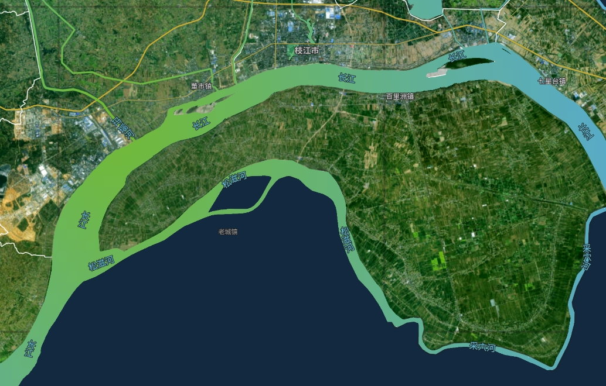

<!-- @format -->
## 契机&&开始

这是一个本来不属于我的活，由于另一个同事研究了很久，选择了一个老板不满意的方向，导致失去了这个【大好机会】，因此，活儿就落到了我头上了😅

需要实现的效果是一个别家的网站地图`mapBox`，通过克里金插值实现出来的河流的渐变效果。



看着其实有点无从下手，毕竟这个地图我也是一脸懵逼的，但是幸好，感谢现在的js混淆技术，关于某个固定的api名称或者某些常量，是不会进行混淆的，从他们家的源码中，逐步分析出来了他们使用的技术，也就是我之前从未听过的克里金插值。

没办法，让我们按图索骥，其实原理很简单，就是比如这一段河流上随机分布着10个监测站点，每个站点在不同时刻检测到的水质都是不一样的，我们需要把这种水质的变化通过给河流上色，来表现出来。

在这里，就有了一个基础，“离散点”、“随机数”、“空间概念”。

## 什么是克里金法

在这里，作为从未接触过这个概念的我来说，略显懵逼，于是百度得到的解释是这样的：

> 克里金法（Kriging）是依据协方差函数对随机过程/随机场进行空间建模和预测（插值）的回归算法 。在特定的随机过程，例如固有平稳过程中，克里金法能够给出最优线性无偏估计（Best Linear Unbiased Prediction, BLUP），因此在地统计学中也被称为空间最优无偏估计器（spatial BLUP）。

>对克里金法的研究可以追溯至二十世纪60年代，其算法原型被称为普通克里金（Ordinary Kriging, OK），常见的改进算法包括泛克里金（Universal Kriging, UK）、协同克里金（Co-Kriging, CK）和析取克里金（Disjunctive Kriging, DK） ；克里金法能够与其它模型组成混合算法。

>若协方差函数的形式等价，且建模对象是平稳高斯过程，普通克里金的输出与高斯过程回归（Gaussian Process Regression, GPR）在正态似然下输出的均值和置信区间相同，有稳定的预测效果。克里金法是典型的地统计学算法，被应用于地理科学、环境科学、大气科学等领域 。

于是，可能更懵逼了。

最后，看了网上关于在cesium中使用克里金插值的使用，大概知道了几点比较重要的条件：

- 需要大于4个离散点，点的经纬度和点的数值
- 需要一个空间范围，可以是当前离散点的边界

在js中，克里金法有开源的算法`kriging.js`，我们在实现中可以使用这个库。

[https://github.com/oeo4b/kriging.js](https://github.com/oeo4b/kriging.js)

## 按图索骥

有了这些，但对应着源码来，我们就可以知道了，怎么计算出一个我们需要的范围内的克里金插值。

假设在范围内有是N个离散点，每个离散点的数值如下：

```js
// 示例点数据
const dotList = [
    { lon: 110.22, lat: 30.7, value: 10 },
    ...
]

// 数值对应的颜色数据
const colors = [
    { min: 0, max: 5, color: "#A9F08E" }, 
    { min: 5, max: 10, color: "#72D66B" }, 
    { min: 10, max: 25, color: "#3DB83D" }, 
    { min: 25, max: 50, color: "#61B7FC" }, 
    { min: 50, max: 100, color: "#0001FE" }, 
    { min: 100, max: 250, color: "#FD00FA" }, 
    { min: 250, max: 1000, color: "#7F013E" }, 
];

// 范围的边界数据
const czExt = {
  xmin: 110.250794,
  ymin: 29.934982,
  xmax: 112.076927,
  ymax: 31.571019,
  xNum: 365,
};
```

我们需要用这些数据，计算出一个克里金插值

```js
// 获取数据的克里金插值
export function getKrigingGisData(data) {
  let siteVas = [];
  let lons = [];
  let lats = [];
  const bounds = czExt;

  let gridResult = [];

  let ext = [
    [
      [bounds.xmin, bounds.ymin],
      [bounds.xmax, bounds.ymin],
      [bounds.xmax, bounds.ymax],
      [bounds.xmin, bounds.ymax],
    ],
  ];

  for (let s of data) {
    if (
      s.lon &&
      s.lat &&
      !isNaN(parseFloat(s.lon)) &&
      !isNaN(parseFloat(s.lat)) &&
      s.value &&
      parseFloat(s.lon) > bounds.xmin &&
      parseFloat(s.lon) < bounds.xmax &&
      parseFloat(s.lat) > bounds.ymin &&
      parseFloat(s.lat) < bounds.ymax
    ) {
      siteVas.push(s.value);
      lons.push(parseFloat(s.lon));
      lats.push(parseFloat(s.lat));
    }
  }
  if (siteVas.length > 3) {
   // 使用gaussian、exponential或spherical模型对数据集进行训练，返回的是一个variogram对象。
   // 0对应高斯过程的方差参数，一般设置为 0。
   // 100对应方差函数的先验值，默认设置为100
    let model = kriging.train(
      siteVas,
      lons,
      lats,
      'spherical',
      0,
      100
    );

    // 使用train返回的variogram对象使ext描述的地理位置内的格网元素具备不一样的预测值
    // (bounds.xmax - bounds.xmin) / bounds.xNum的bounds.xNum是返回的网格数量,越大越细处理越慢
    gridResult = kriging.grid(
      ext,
      model,
      (bounds.xmax - bounds.xmin) / bounds.xNum
    );
  } else {
    gridResult = [];
  }
  // 得到一个克里金插值grid
  return gridResult;
}
```

一般的常规做法是使用这个得到的grid网格，渲染到canvas上面，再把这个canvas用贴图材质的方式渲染到cesium图层上，但是这里我们有点不一样的是，作为河流的json来说，它的面片是分散，而且部分河流不是`Polygon`、`MultiPolygon`，而是`LineString`、`MultiLineString`。

而在Cesium中，我们需要绘制出渐变色的河流，全部的河流是面+线的组合展示。

鉴于我们要做的是复刻别人家的地图的实现方式，因此数据来源json是有自带离散指数，我们根据网格grid获取每一段数据的数据，再根据数值获取对应的颜色，就可以获取对应的每一小段json数据的颜色，并且进行绘制。

鉴于不是前端单独实现，还会json级别的后台处理，因此，该方法只可以借鉴。

```js
// 根据插值计算色块
const dealGridColor = (gridResult, properties) => {
  if (gridResult[properties.R] && gridResult[properties.R][properties.C]) {
    let a = gridResult[properties.R][properties.C];
    return getColor(a * 10);
  } else {
    return riverColor;
  }
};

// 绘制河流面
export const drawRiverLayer = async (gridResult) => {
  NormalPoi.addDot({
    name: "river_layer_polygon",
    list: riverJson.features,
    renderPolygon: (item) => {
      const lonLatArr = item.geometry.coordinates.flat(3);
      // 根据插值计算色块
      const color = dealGridColor(gridResult, item.properties);
      return {
        polygon: {
          hierarchy: Cesium.Cartesian3.fromDegreesArray(lonLatArr),
          material: Cesium.Color.fromCssColorString(color),
        },
      };
    },
  });
};
// 绘制河流线
export const drawRiverLine = (gridResult) => {
  NormalPoi.addDot({
    name: "river_layer_line",
    list: riverLineJson.features,
    renderPolygon: (item) => {
      const lonLatArr = item.geometry.coordinates.flat(3);
      // 根据插值计算色块
      const color = dealGridColor(gridResult, item.properties);
      return {
        polyline: {
          positions: Cesium.Cartesian3.fromDegreesArray(lonLatArr),
          material: Cesium.Color.fromCssColorString(color),
          width: item.properties.DISPCLASS || 2, // DISPCLASS 河流宽度
        },
      };
    },
  });
};
```

## kriging.js使用方法解析

```js
kriging.train ( siteValue, lngs, lats, ‘exponential’, 0, 100 );
```

使用gaussian、exponential或spherical模型对数据集进行训练，返回的是一个variogram对象。
0对应高斯过程的方差参数，一般设置为 0。
100对应方差函数的先验值，默认设置为100。

```js
kriging.grid ( ex, variogram, (maxy - miny) / 500 );
```

使用train返回的variogram对象使ex描述的地理位置内的格网元素具备不一样的预测值。
(maxy - miny) / 500的500是返回的网格数量,越大越细处理越慢。

```js
kriging.plot ( canvas, grid, [minx, maxx], [miny, maxy], colors );
```

将得到的格网grid渲染至canvas上。
这里我们更改了plot方法的色彩赋值，更改后就可以根据数据范围赋予自定义的色彩了。
