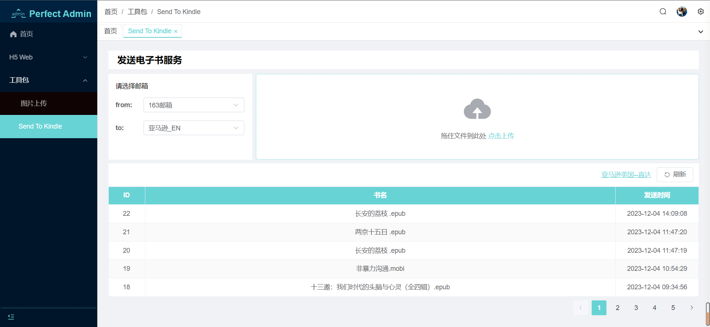
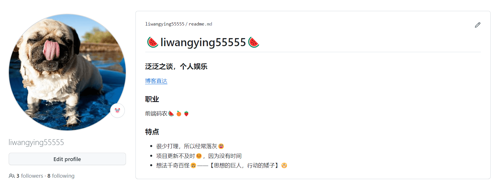
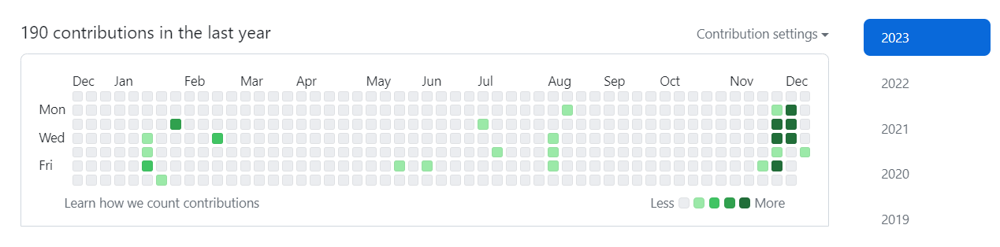

## 年度计划

计划列表:100:

- 服务器 nginx 部署博客:heavy_check_mark:
- 博客脚本部署（本地脚本一键化自动构建+部署 ftp）:heavy_check_mark:
- 自动部署平台（目前技术栈设想 vue3.0 + vue cli + vite）
- mock 平台 + 中台实现可能性
- 服务器 server（承接以后的可能会有的所有小项目）

## 一月份过年初体验

月初的时候出去玩了一趟，目标城市：:snowman:哈尔滨+:snowflake:北京，虽然去的都是一些目标性建筑，也体验了-20° 的冷，看了场北方的雪，睡了北方的炕，总的来说实现了一个小目标：说走就走+出门旅游。

今年是新的开始，因为准备定居在家乡——:star:<b>宜昌</b>:star:了，需要学习的是，要怎么和家里人好好相处。毕竟，长时间的漂泊异地，我可能只学会了怎么一个人好好的生活。

:hamster:

## 五月份，家里来新成员啦

从邻居家抱养了一只两个月大的小猫，刚到新家的小猫缺乏安全感，可粘人了。一段时间之后，格外的放肆起来，家里蹦迪，跑酷，各种蹦跶。

我也是有小猫的人了。不过猫:shit:也是真的臭哦！

:cat:

好好生活，好好工作，毕竟如何:heart:取悦自己:heart:并不是一件简单的事情。

## 年底总结

摸鱼了一年，写了一年的业务代码，年底的时候倒是有了将近一个月的空余时间。

总是摸鱼也是摸鱼也是没有办法的事情， 太闲了，感觉人都长草了，每天坐在办公室就是打卡->静坐->中饭->午休->打卡->静坐->下班。。。

真真的是人都消瘦了，一度怀疑自己已经不会写代码了🕶️。

后来11月底的时候，腾讯云服务器到期了（虽然买了三年，但是利用率为0😂），于是还是想着，总是可能会用到的一天，买了华为云的服务器，开始折腾起来。

服务器用的最简单的linux可视化宝塔面板，慢慢摸索配置了ftp，nginx。本来是没有任何动力的，因为懒嘛。

但是某一天，一个想法击中了我，我可以在自己的管理系统里面，上传从网络上download的一些些电子书，然后，系统自己去发邮件到kindle邮箱，这样下来的操作，明显比我自己用163发邮件，来实现 send to kindle 要便捷一些。

于是就开始完善之前只写了登录的管理系统，后端用`nodejs`实现的服务，自己前后端一把梭。

然后的然后，这个功能的就实现了。

刚刚好，因为同时进行的项目实在太多，部署的时候太麻烦，于是把之前写的一个本地的ftp文件传输的小脚本做了一个命令行工具，[`ftp-local-transfer`](https://www.npmjs.com/package/ftp-local-transfer)，实现了自己用，乐无穷。

于是顺带着把github的项目也整理了一下，隐藏了一些不开源的项目，整理了一个github首页的`readme.md`，看起来还是比较好看的。

我估计这段时间的提交量是我账号注册以来的高峰期阶段吧😄。

总的来说，今年的生活平平淡淡，技术上也没什么大的长进，如果说有，那估计就是从使用者的角度来讲，`Vue`用的比之前溜了许多，因为上一份工作还是用的`React`，基本重新学习`Vue 3.0`的使用吧。说到底，还是一使用者，并没有更多的理解工具的本质。

## In the end

让我们来看一下年初计划表的实现情况吧🤣

- [x] 服务器 nginx 部署博客（**博客改版**）
- [x] 博客脚本部署（本地脚本一键化自动构建+部署 ftp）（**本地脚本工具变`ftp-local-transfer`**）
- [ ] 自动部署平台（目前技术栈设想 vue3.0 + vue cli + vite）（**有心无力**）
- [ ] ~~mock 平台 + 中台实现可能性~~（**废弃方案**）
- [x] 服务器 server（承接以后的可能会有的所有小项目）（**管理系统+`Nodejs`服务**）

👏👏👏👏👏👏
