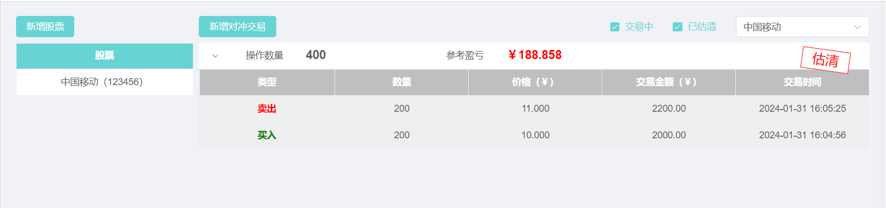
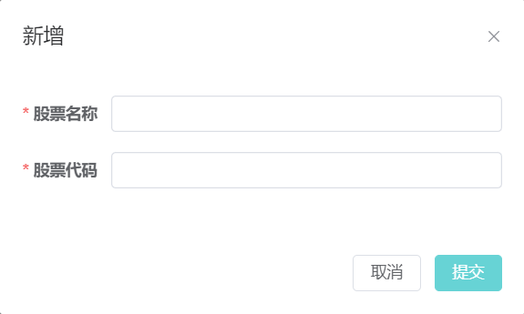
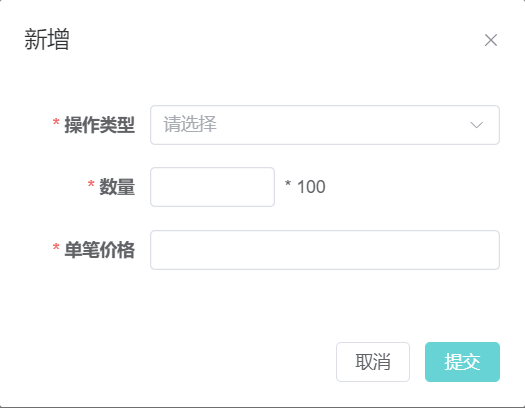
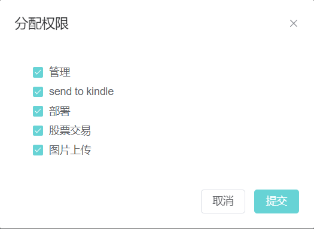
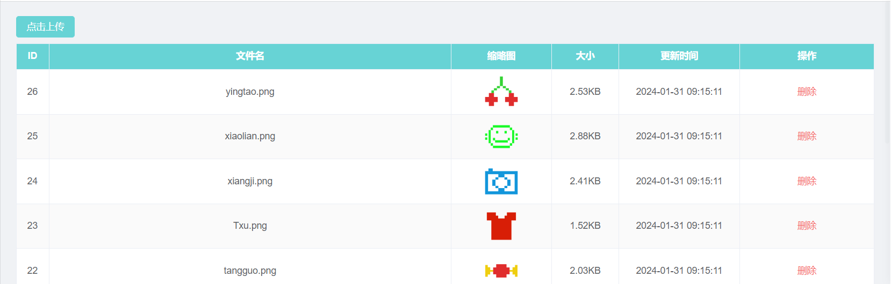

## 本年度计划

- [ ] 自动化部署平台
- [ ] 深入了解并掌握three.js
- [ ] 上线一些实用的小工具

## 已实现功能

### 交易中心

股票虽然在亏钱，但是我还是一心想着回本的，因此，长线操作的时候，往往因为长线太长，会忘记历史的操作成本，就这样越亏越多。。。

因此实现了一个单线的股票对冲功能，用于统计买入卖出相同数量时，差价多少，大概的一览总体盈亏。

### 权限分配

本来呢，作为自己使用的管理系统，不需要分权限，分账户，但是基于上面的股票对冲功能，是需要按账户来记录数据的，因此，有了这个功能的诞生。这样就可以将管理系统的功能模块按账户来区分了。

### 图片上传

本来最开始是准备对接七牛云的api，把资源放在那个上面，从而减轻自己买的廉价服务器的责任，但是实在是研究不明白cdn域名解析的相关一系列操作，没得办法，文件就放在服务器吧。

本来这个功能最初是为了给小程序用的，但是目小程序的需求还不太明确，暂时搁浅了。

但是呢，这个功能还是出来了。

