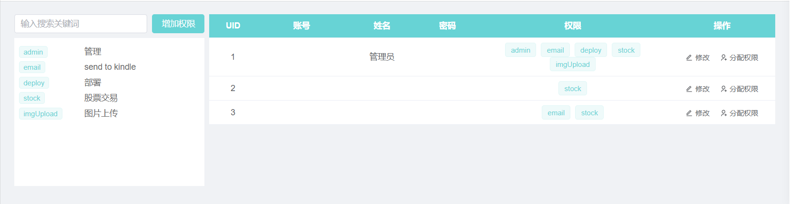

## 本年度计划

- [ ] 自动化部署平台
- [ ] 深入了解并掌握three.js
- [ ] 上线一些实用的小工具

## 已实现功能

### 交易中心

股票虽然在亏钱，但是我还是一心想着回本的，因此，长线操作的时候，往往因为长线太长，会忘记历史的操作成本，就这样越亏越多。。。

因此实现了一个单线的股票对冲功能，用于统计买入卖出相同数量时，差价多少，大概的一览总体盈亏。

### 权限分配

本来呢，作为自己使用的管理系统，不需要分权限，分账户，但是基于上面的股票对冲功能，是需要按账户来记录数据的，因此，有了这个功能的诞生。这样就可以将管理系统的功能模块按账户来区分了。

### 图片上传

本来最开始是准备对接七牛云的api，把资源放在那个上面，从而减轻自己买的廉价服务器的责任，但是实在是研究不明白cdn域名解析的相关一系列操作，没得办法，文件就放在服务器吧。

本来这个功能最初是为了给小程序用的，但是目小程序的需求还不太明确，暂时搁浅了。

但是呢，这个功能还是出来了。

## 额外的贡献

### cesium系列

[【从入门到放弃】](/FrontEnd/Cesium/从入门到放弃(一).html)

需求才是最佳的生产力，好吧，上半年一直在死磕Cesium项目，从零开始的那种，因此有了一些些的感悟，得到了这系列的文章。

但是其实吧，上半年就已经陆陆续续的结束了这项工作，后面一直鸽到年末的样子，是的，翻看了一下时间表，中间差了有半年😂。

但是但是但是，在10月31日，我写完了。感谢老板监工，让我没有再愉快的玩耍摸鱼，因此拾起了这项伟大的工作。

也是，作为一个积极性不高，懒惰性+拖延症极强的人来说，主动去做总结和盘点是件特别不容易的事情，但是，我完成了~

果然，人只要逼一逼，还是什么事情都能做的😊。

## In the end

让我们来看一下年初计划表的实现情况吧🤣

- [ ] 自动化部署平台（**重度拖延症患者，不知道什么时候能完成**）
- [ ] ~~深入了解并掌握three.js~~（**已放弃**）
- [x] 上线一些实用的小工具（**交易中心**、**权限分配**、**图片上传**）
- [x] 按心情写一些小文章（**Cesium地图系列入门版**）

👏👏👏👏👏👏
