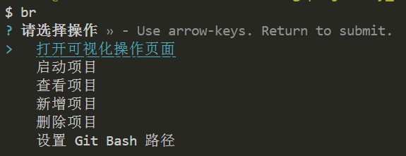
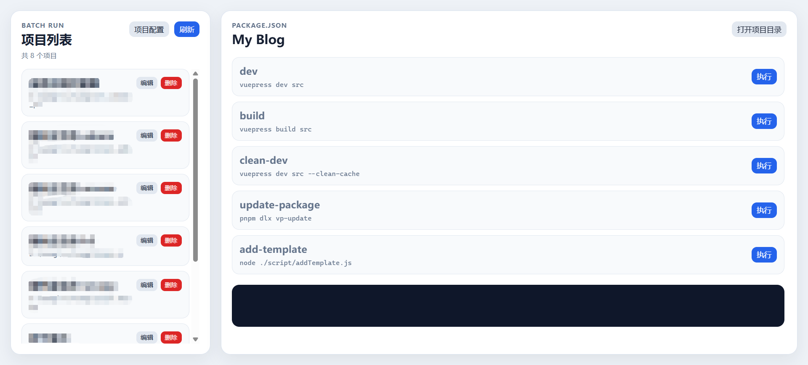

# batch-run-local

`batch-run-local` 是一个本地 npm scripts 管理工具。

它可以把多个本地项目统一管理起来，通过命令行或本地 Web 页面选择项目，并打开 Git Bash 执行对应的 `package.json scripts`。

项目地址：[`batch-run-local`](https://www.npmjs.com/package/batch-run-local)

## 1. 它适合解决什么问题？

本地项目较多时，经常会遇到这些问题：

- 项目路径分散，每次启动都要手动找目录。
- 每个项目的 `scripts` 不完全一致，需要频繁查看 `package.json`。
- Windows 环境下习惯使用 Git Bash，但每次都要手动打开和切换目录。
- 想在本地集中管理项目，不希望把额外配置写入业务项目。

`batch-run-local` 的作用就是把这些项目路径保存起来，启动时自动读取对应项目的 `package.json scripts`，再通过 Git Bash 执行命令。

## 2. 安装使用

全局安装：

```shell
npm install -g batch-run-local
```

安装后可以使用 `br` 命令：

```shell
br
```

直接执行 `br` 会打开交互菜单，界面如下。



## 3. 可视化操作界面

```shell
br ui
```

执行后会启动本地服务并打开浏览器。



Web 页面支持：

- 查看已配置项目。
- 新增、编辑或者删除项目。
- 读取项目 `package.json` 中的 `scripts`。
- 点击按钮执行对应脚本。
- 打开项目目录。

## 4. 命令行式使用

### 添加项目

```shell
br add
```

根据提示输入项目名称和项目根路径：

```text
项目名称
项目根路径
```

比如我想把博客项目加进去，就可以这样理解：

```text
项目名称：my_blog
项目根路径：C:\XXXX\project\my_blog
```

项目根路径需要指向包含 `package.json` 的目录。工具会在运行时读取该文件中的 `scripts`，不需要单独维护脚本配置。

### 查看项目

```shell
br list
```

该命令会列出已添加的项目名称、项目 id 和项目路径，以及配置文件所在地址。

可直接修改配置文件，以便更快捷的全局修改。

### 启动项目

```shell
br run
```

执行后会先选择项目，再选择该项目下的 npm script。

例如项目的 `package.json` 中包含：

```json
{
  "scripts": {
    "dev": "vite",
    "build": "vite build",
    "preview": "vite preview"
  }
}
```

选择 `dev` 后，工具会在项目目录下打开 Git Bash，并执行：

```shell
npm run dev
```

## 7. Git Bash 路径配置

工具默认会自动检测常见的 Git Bash 路径：

```text
C:\Program Files\Git\git-bash.exe
C:\Program Files (x86)\Git\git-bash.exe
```

如果检测失败，可以手动配置：

```shell
br config
```

`br config` 也可以修改 Web 服务端口，默认端口为：`1234`

## 8. 删除项目

```shell
br remove
```

该命令只会删除 `batch-run-local` 中保存的项目配置，不会删除真实项目目录。

## 9. 常用命令速查

```shell
br          # 打开主菜单
br add      # 新增项目
br list     # 查看项目
br run      # 选择项目和 scripts 后执行
br ui       # 打开本地 Web 管理页面
br config   # 设置 Git Bash 路径和 Web 端口
br remove   # 删除项目
```
