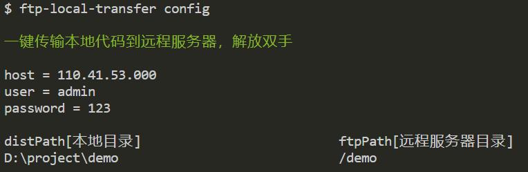
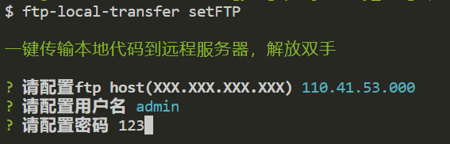
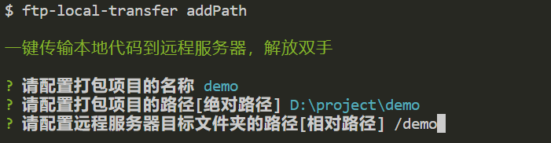
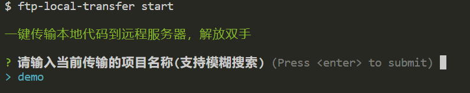

# ftp-local-transfer

最近开始有时间了，就写了一些小东西，包括但不限于一个后台管理系统，配套的NodeJs服务，博客改版等等。。。

多个项目一起混合开发，避免不了一个问题？我的代码怎么上传呢？每一次都要手动连接XFTP，然后左边找到项目打包dist，后边找到对应的传输路径吗？作为一个工具人，虽然我很热爱复制粘贴，但是大量重复的毫无意义的复制粘贴，还是很令人头疼的。

因为才有个这个命令行工具的诞生——[`ftp-local-transfer`](https://www.npmjs.com/package/ftp-local-transfer)。

全局安装，一次配置，收益终生！

## 起源

说实话，作为一个纯纯的切图仔，对于这种命令行式的工具，还是接触的很少的。这个工具的最开始只是一个项目内置的`js`脚本，直接执行，配置都是写死在代码里的，目的当然是为了上传服务器更便捷。

后来，当有了一个，两个，三个甚至更多的项目时，这种项目内部的脚本就不能够满足我的当下情况了。

因此，我需要一个可以全局配置参数，配置各种打包路径的本地传输工具。

:::tip
注意哦，是本地，线上一键部署正在构思中...
:::

然后我就用我浅薄的小脑袋瓜儿一想，`nrm`源管理器不就是一个全局安装，全局配置的命令行式的工具嘛，不是可以借鉴一下嘛。

于是了解到了`commander`，这个强大的`NodeJs`命令行界面的完整解决方案，再加上`inquirer`这个交互式命令行工具，双管齐下，这不就成了，于是说干就干。

## 功能

思路清晰之后，我们需要的功能就能确定了。

- 读取所有本地化配置
- 设置fpt账户
- 添加本地上传项目路径
- 关键一步：**上传**

### 安装

```shell
npm i -g ftp-local-transfer
```

全局安装成功之后，因为涉及到配置文件的修改，请在具有管理员权限的命令工具中执行下下面的操作

### 读取所有本地化配置

配置完所有参数之后，可以看到你的所有的配置信息

```shell
ftp-local-transfer config
```



### 设置fpt账户

此处`host`填写的你的服务器公网ip，账户和密码均为你自己的服务器ftp配置

```shell
ftp-local-transfer setFTP
```



### 添加本地上传项目路径

:::tip
本地上传文件夹路径为**绝对路径**，直接复制文件栏的路径即可
远程服务器文件路径为**相对路径**，相对于你的ftp账户密码授权的文件根路径
:::

```shell
ftp-local-transfer addPath
```



### 自行修改配置

如果想要原有的基础上直接修改配置文件，先执行`npm -g root`，会得到`npm`全局包的安装路径，找到`ftp-local-transfer`文件夹，配置文件在`config`文件夹中

```shell
$ npm -g root
C:\WINDOWS\system32\node_modules

# 配置文件
$ cd ftp-local-transfer

$ ls
CHANGELOG.md  config/  ftp.js  index.js*  LICENSE  node_modules/  package.json  README.md

$ cd config
$ ls
ftpConfig.json  pathConfig.json
```

### 关键一步：**上传**

最后一个，确认所有配置正确之后，选择本次上传的项目，直接开始🍅

```shell
ftp-local-transfer start
```



具体实现代码这里就不贴了，难度不大，主要是思路分享，有兴趣可以移步[ftp-local-transfer](https://github.com/liwangying55555/ftp-local-transfer)看看
